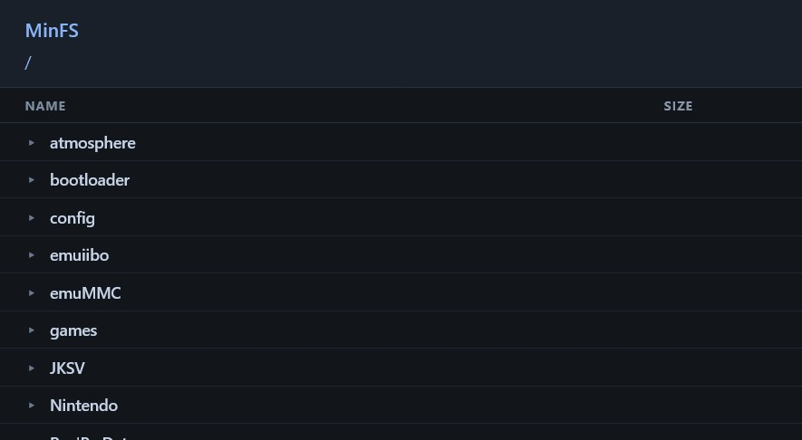
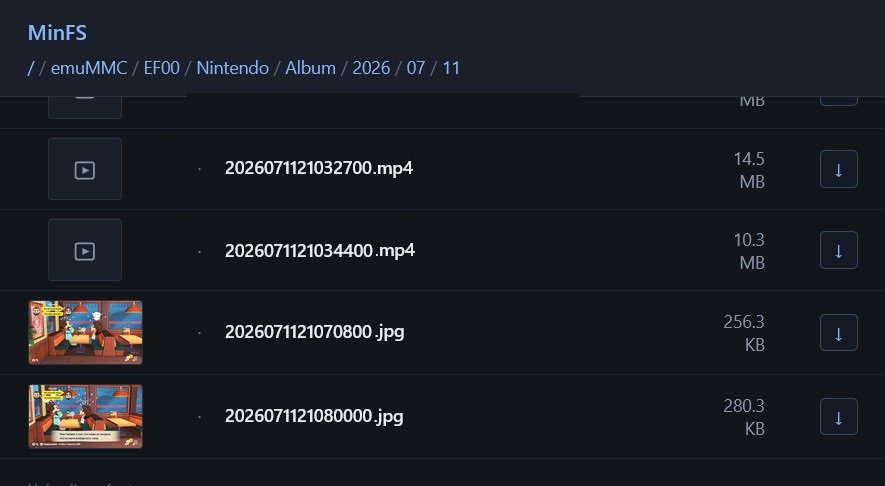

# minFS

A browser-based file manager for the Nintendo Switch running Atmosphere. minFS runs a small HTTP server on the console (default port `8080`) so you can browse the SD card from a PC browser: list folders, download files, and view images and videos inline.

Two builds are provided:

- **Sysmodule** — runs in the background on Atmosphere and is the recommended way to use minFS.
- **NRO** — a homebrew app for testing from hbmenu; it prints the server address to the console.

## Features

- Directory listing: folders, files, sizes, breadcrumbs, and `..` navigation
- Inline image thumbnails (`/img`)
- File downloads with the correct filename (`/download`)
- Inline video playback with seeking (`/video`) via single-byte range requests (`206 Partial Content`, `416` for unsatisfiable ranges, `Accept-Ranges: bytes`)
- Fullscreen media viewer: prev/next buttons, keyboard arrows, touch swipe, `Esc` to close
- Configurable HTTP port and start folder (`minfs.ini`)
- Optional file logging, toggleable at runtime (no rebuild, no reboot)
- Ultrahand integration: status row (IP/port), port selector, logging toggle, and a startup notification with the web address
- Self-healing listener: the socket is rebound automatically if the network drops

## Screenshots





## Requirements

- A Switch with custom firmware (Atmosphere)
- A network connection (Wi-Fi or LAN)
- A modern browser on the PC for the web UI
- Ultrahand (recommended) — console IP display, port selector, and logging toggle
- To build from source: devkitPro with libnx and `DEVKITPRO` set in the environment

## Installation

### Sysmodule (recommended)

1. Copy the built `minFS.nsp` into the module's contents slot as **`main.nsp`**: `sdmc:/atmosphere/contents/420000000007E5AC/main.nsp`.
2. Copy `toolbox.json` from the repository root to `sdmc:/atmosphere/contents/420000000007E5AC/toolbox.json`.
3. Optional — auto-start at boot: create an empty file `sdmc:/atmosphere/contents/420000000007E5AC/flags/boot2.flag`.
4. Enable the module in Ultrahand → **Sysmodules** (or reboot with `boot2.flag` present).

### Dev build (NRO)

1. Copy `minFS.nro` to the SD card, e.g. `sdmc:/switch/`.
2. Launch it from hbmenu. The address to open is printed on the console.

### Ultrahand package (optional)

1. Copy the `ultrahand/minFS/` folder to `sdmc:/switch/.packages/minFS/` on the SD card.
2. In Ultrahand, open the package list and select **minFS**. It provides the status row (IP, port, start path), a `[*Server Port]` selector, a `[Logging]` toggle, and log management (`[View Log]` / `[Clear Log]`).

Notes:

- Ultrahand installs a copy of the package at install time, so changes to `ultrahand/minFS/` only apply after reinstalling the package.
- `toolbox.json` is **not** part of the package — it is copied separately into the sysmodule's contents slot (step 2 above).

## Usage

1. Find the console IP (Ultrahand status row, your router, or the NRO screen).
2. Open `http://<ip>:8080` in a browser on the same network (use the configured port if you changed it).
3. Navigate by clicking folders, using `..`, the breadcrumbs, or the "To root" link on the error banner.
4. Download a file with the arrow button in the last table column.
5. Click an image thumbnail or a video tile to open the media viewer. Navigate with the on-screen buttons, keyboard arrows, or touch swipe; press `Esc` or click the backdrop to close.

## Configuration

Runtime options live in `sdmc:/switch/minfs.ini`:

```ini
[server]
port = 8080
start_path = sdmc:/switch
```

| Key          | Default       | Description                                         |
| ------------ | ------------- | --------------------------------------------------- |
| `port`       | `8080`        | TCP port the HTTP server binds to                   |
| `start_path` | `/` (SD root) | Folder shown when the web UI opens (SD path or `/`) |

Notes:

- A missing or invalid `port` falls back to `8080`; a missing `start_path` falls back to the SD root.
- Settings are read once at startup — changing the file requires restarting the module.

### Logging (sysmodule)

- Log file: `sdmc:/switch/minFS.log`.
- Logging is enabled while the flag file `sdmc:/atmosphere/contents/420000000007E5AC/flags/logging.flag` exists. The flag is checked on every write, so toggling it applies immediately (the Ultrahand `[Logging]` row does exactly this).
- Build with `make ENABLE_LOGGING=1` to force logging on regardless of the flag.
- File logging is a sysmodule-only feature; the NRO dev build prints debug output to the console instead.

## HTTP API

All routes accept `GET` only.

| Route                         | Purpose                                                                              |
| ----------------------------- | ------------------------------------------------------------------------------------ |
| `/`                           | Web UI (`text/html`)                                                                 |
| `/css/styles.css`, `/js/*.js` | Embedded UI assets (compiled into the binary)                                        |
| `/api?path=...`               | Directory listing as JSON; omitted `path` → `start_path`                             |
| `/download?path=...`          | Downloads a file (`Content-Disposition`, basename as filename)                       |
| `/img?path=...`               | Serves an image inline (`image/*`); other extensions → `415`                         |
| `/video?path=...`             | Serves a video inline (`video/*`) with byte-range seek; unsatisfiable ranges → `416` |

Listing format:

```json
{
    "path": "/",
    "parent": null,
    "items": [
        { "name": "switch", "dir": true, "size": 0 },
        { "name": "note.txt", "dir": false, "size": 123 }
    ]
}
```

Example:

```
curl -s 'http://192.168.1.42:8080/api?path=%2F' | head
```

## Build

Requires devkitPro + libnx. On Windows, build from the devkitPro MSYS2 login shell — stock PowerShell has no `aarch64-none-elf-gcc`. The Makefile hard-errors if `DEVKITPRO` is unset.

| Command                 | Result                              |
| ----------------------- | ----------------------------------- |
| `make`                  | Sysmodule `minFS.nsp`               |
| `make nro`              | Dev build `minFS.nro` for hbmenu    |
| `make ENABLE_LOGGING=1` | Sysmodule with forced file logging  |
| `make clean`            | Removes build artifacts and outputs |

Web assets under `web/` are embedded into the binary as C string literals at build time — nothing under `web/` is read from disk at runtime.

There are no tests, linter, or formatter in this project.

## Project structure

```
source/               C source (single-threaded HTTP server)
  main.c              sysmodule / hbmenu entry points
  http_server.c       socket handling, request dispatch, file streaming, ranges
  http_request.c      raw request parsing (method, target, Range header)
  fs_list.c           directory listing -> JSON
  mime.c              extension -> MIME type lookup
  path_util.c         percent-decoding, path normalization, / <-> sdmc:/ mapping
  config_file.c       minfs.ini parsing ([server] port, start_path)
  log.c               console/file logging with runtime flag check
  notify.c            Ultrahand startup notification
web/                  UI (index.html, CSS, ES-module JS) - embedded at build time
ultrahand/minFS/      Ultrahand package (status, port, toggles, log view)
Makefile              build configuration
minFS.json            NPDM config for the sysmodule (title ID 420000000007E5AC)
toolbox.json          Ultrahand toolbox opt-in config for the sysmodule slot
```

## Architecture

minFS is a single-threaded HTTP server. A poll loop accepts one client per pass, dispatches the request to a route handler, and streams file responses in 64 KB chunks. In sysmodule builds the SD card mounts at `sdmc:`, so client-facing paths like `/foo` are mapped to `sdmc:/foo` before touching the filesystem (root `/` → `sdmc:/`). The listener is non-blocking and monitored; if the network drops or the socket dies, it is closed and rebound automatically. The design deliberately favors simplicity and predictability over throughput.

## Limitations

- **Read-only** — no upload, delete, rename, or directory creation.
- **One request at a time** — during a large download nothing else is served.
- **Range requests on `/video` only** — seeking is not supported on `/img` or `/download`.
- **No authentication or TLS** — anyone who can reach the console IP can read the entire SD card. Use it on a trusted network only.
- In sysmodule mode the web root `/` maps to the physical SD card root (`sdmc:/`); in the NRO dev build `/` is the hbmenu root.

## License

MIT — see [LICENSE](LICENSE).
